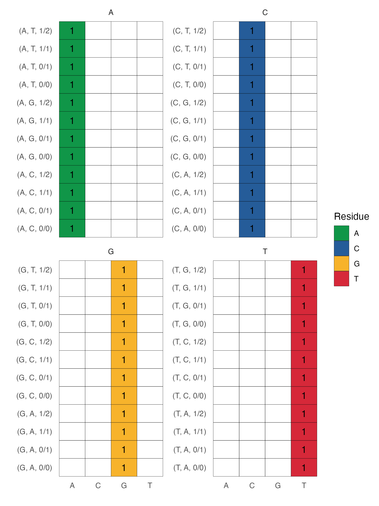
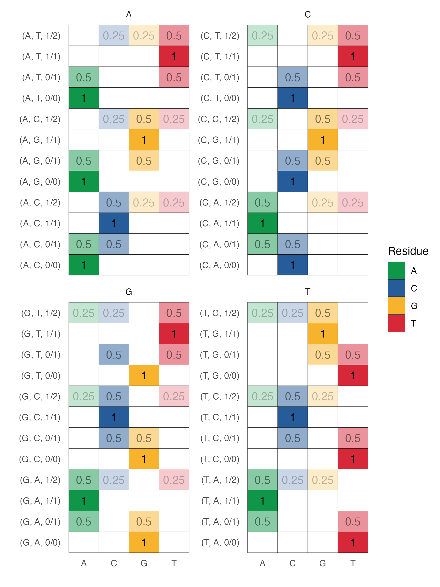
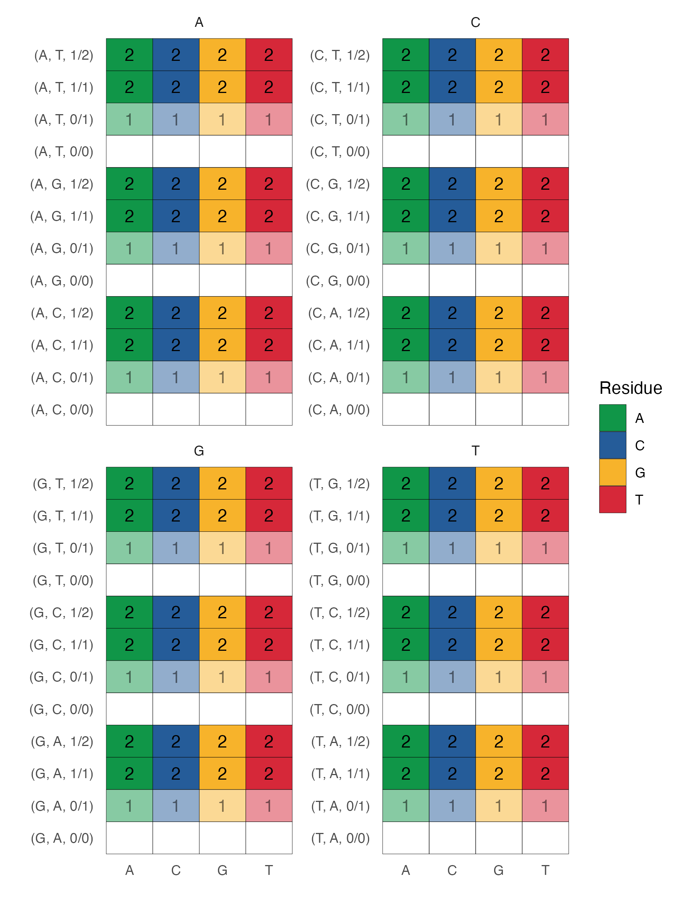

# vencoder
Python module to encode variants in a variety of schemes.

# Motivation

Suppose you have some reference sequence (`A,A,C,C,G,G,T,T...`) and a list of variant calls (). In variant call parlance, 0/1 means there is one copy of the reference (reference is denoted 0) and one copy of the alternate (denoted 1) allele. It is also possible to observe 1/2, meaning one reference alternate allele (i.e. an alternate allele that is somewhat common) and one *really* alternate allele. So, 0/0 means two copies of the reference (and is the most common occurence), 0/1 means one copy of reference and one copy of alternate. 1/2 indicates one copy of the alternate and one copy of something that is not the reference or the (recorded) alternate. 

| 0-based | 1-based | Reference | Alternate | Variant Call |
|---------|---------|-----------|-----------|--------------|
| 0 | 1 | A | T | 0/1 |
| 1 | 2 | C | . | 0/0 |
| 2 | 3 | A | G | 1/1 |

# One-hot Encoding

The standard in the field is to encode each reference nucletide as a length four vector with a one corresponding to the reference nucleotide. For example, `A` gets encoded as `[1, 0, 0, 0]`, `C` gets encoded as `[0, 1, 0, 0]`, `G` as `[0, 0, 1, 0]` and `T` as `[0, 0, 0, 1]`. There's nothing special about this ordering. This captures the lion's share of genomic information (since most positions are 0/0 indicating homozygous reference). But it of course disregards any variants: 0/1, 1/1, or 1/2.

We implement a one-hot encoder here. Note that it only uses information from the reference genome (i.e. it will not one-hot encode a homoyzgous alternate allele). Demo data encodings are found below.

# Variant

The variant encoding scheme is shown below.

# Additive / Masking

Finally, we consider a second layer of information captured by a variant mask where each row is filled with the number of alternate aleles at the corresponding position. This is similar to the "additive model" in statistical genetics. Information encoded by this scheme disregards the actual nucleotide sequence and instead retains information on whether a position is homozygous reference or not.

